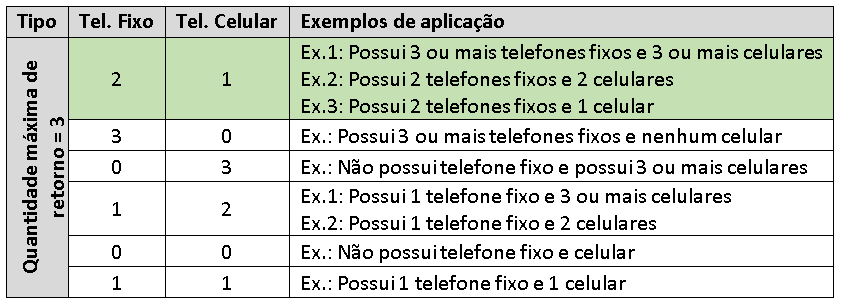

# API de Consumo - Nova Cadastral

Arquivos extras utilizados como base e documentação ficam em [docs](util/docs)
Api para consumo de Nova Base Cadastral, disponibilizada via Url's versionadas e Socket. Podem ter como fonte de dados as bases Exadata ou Accumulo

[online doc](http://dados.bvsnet.com.br/api/doc) Url Base: `http://dados.bvsnet.com.br/api`

## Configuração de comportamentos via ativação de Spring Profiles

### Fonte de dados
* [accumulo](util/run-prod.sh) Habilita busca em base Accumulo
* [exadata](util/run-prod.sh) Habilita busca em base Exadata
    
### Ambientes:
* [dev](core-api/src/main/resources/application.yml)
    * Rest: `http://localhost:3333/api`
    * Socket: `127.0.0.1`, porta `5555`
* [homol](core-api/src/main/resources/application.yml)
    * Rest:
        * `http://dados-hml.bvsnet.com.br/api`
        * `http://dtbhad01h.bvs.corp:3333/api`
        * `http://dtbhad02h.bvs.corp:3333/api`
    * Socket:
            * `dtbhad01h.bvs.corp`, porta `5155` 
            * `dtbhad02h.bvs.corp`, porta `5155`
* [prod](core-api/src/main/resources/application.yml)
    * Rest:
        * `http://dados.bvsnet.com.br/api`
        * `http://dtbhad01p.bvs.corp:3333/api`
        * `http://dtbhad02p.bvs.corp:3333/api`
    * Socket:
        * `dtbhad01p.bvs.corp`, porta `5155` 
        * `dtbhad02p.bvs.corp`, porta `5155`

Para cada ambiente há um script de inicialização em `util/run-<ambiente>.sh`

### Profiles extras
* [socket](core-api/src/main/resources/application-socket.yml) Habilita camada socket
* [dePara](core-api/src/main/resources/application-dePara.yml) Habilita De/Para's
Obs: `socket` e `dePara` somente se aplicam para as camadas `V1` da aplicação.

Estes profiles já são incluidos independente do `Ambiente` através da propriedade `spring.profiles.include` 

## Logs
São gerados logs de forma a debugar a aplicação e tempos de resposta
- [log4j2](core-api/src/main/resources/log4j2.xml)

```xml
<Logger name="br.com.bs.rest.process.RequestTimeProcess" level="info" additivity="false">
    <appender-ref ref="restRequestTimeLog" />
</Logger>
```

Tempo busca e parse de busca e ordenação de resultados
- debug: liga
- info: desliga
```xml
<Logger name="br.com.bs.socket.service.ConsultaSocketService" level="info" additivity="false">
    <appender-ref ref="socketRequestTimeLog" />
</Logger>
```

Tempo busca e parse de busca e ordenação de resultados
- debug: liga
- info: desliga
```xml
<Logger name="br.com.bs.accumulo.AccumuloScan" level="debug" additivity="false">
    <appender-ref ref="fetchTimeLog" />
</Logger>
```

Tempo busca e parse de busca
- debug: liga
- info: desliga
```xml
<Logger name="br.com.bs.exadata.ExadataScan" level="debug" additivity="false">
    <appender-ref ref="fetchTimeLog" />
</Logger>
```

Tempo busca e aplicação de regras caso exista, antes da montagem da resposta(Json/Socket)
- debug: liga
- info: desliga
```xml
<Logger name="br.com.bs.util.process.ProcessWithTimeout" level="debug" additivity="false">
    <appender-ref ref="stopWatchLog" />
</Logger>
```

## Configuração de endpoints rest e serviços socket 

Adicionando novo endpoint Rest:
Deverá ser construido novo `RestServerBuilder<VERSION>.java` e `ConsultaRestService<VERSION>.java` correspondentes, sendo configurados através de `RestServerBuilder.java` no mesmo server `http`.
* [RestServerBuilder.java](core-api/src/main/java/br/com/bs/rest/builders/RestServerBuilder)  constrói server tcp na parta espacificada na configuração de [app.rest](core-api/src/main/resources/application.yml) 
* [RestServerBuilderV1.java](rest-api-v1/src/main/java/br/com/bs/rest/v1/RestServerBuilderV1.java) constrói endpoints
* [ConsultaRestServiceV1.java](rest-api-v2/src/main/java/br/com/bs/rest/v2/ConsultaRestServiceV2.java) camada de regras de negócio e buscas
* [RestServerBuilderV2.java](rest-api-v2/src/main/java/br/com/bs/rest/v2/RestServerBuilderV2.java) constrói endpoints
* [ConsultaRestServiceV2.java](rest-api-v2/src/main/java/br/com/bs/rest/v2/ConsultaRestServiceV2.java) camada de regras de negócio e buscas

Adicionando novo serviço Socket:
* [SocketServerBuilder.java](socket-api/src/main/java/br/com/bs/socket/builders/SocketServerBuilder.java) constrói server tcp na parta espacificada na configuração de [app.socket](core-api/src/main/resources/application-socket.yml)
* [ConsultaSocketService.java](socket-api/src/main/java/br/com/bs/socket/service/ConsultaSocketService.java) Identifica serviços e executa requests

### V1

Urls `V1` e `Socket` disponibilizados para satisfazer compatibilidade com sistemas legados, que antes invocavam Procedures SQL ou Socket Java intermidiário.

Para todos os endpoints e chamadas socket podem haver [de/para](core-api/src/main/resources/application-dePara.yml), e campos resultantes são limitados através da propriedade `app.contexto-list.<contexto>.colunas` 
* Obs De/Para's: Ocorrem para nome de campos, e para tabelas dominios, onde na base atual existe somente a descrição e deve ser complementado com código ou através do código, coplementar com a descrição.

Para todos os resultados será calculado o campo `COD_PSS_FIS` que é resultante da concatenação de `NUM_CPF_CNPJ` + `COD_ORGM`
* Regra aplicada para fins de possibilidade de agrupamento de `Outras Grafias` em determinados produtos, onde os dados de cadastro como nome, deve aparacer no mesmo grupo os `telefones` e `endereços` correspondentes, sendo estes da mesma `Origem` informante;
 
#### Endpoints Rest
Todos endpoint's construidos para satisfazer regras pré-existentes nas procedures. Juntamente com seus detalhes das principais regras de negócios que alteram o resultado da busca.

* health
* login
    * /login
* contato
    * /v1/contato/cpf/{cpf}
    * /v1/contato/cpf/{cpf}/origem/{origem}
        * Regra de concatenação de DDD + Número em campo `(NUM_TEL)`
        * Realiza tratamento em campo `COD_CLSS_CTAT`, mantendo somente o código.
        * Regra de apresentação de no máximo 3 Telefones por consulta, de acordo com a seguinte tabela:
            * 
* documento
    * /v1/documento/cpf/{cpf}
    * /v1/documento/cpf/{cpf}/origem/{origem}
    * /v1/documento/cpf/{cpf}/tipo/{tipo}
* endereco
    * /v1/endereco/cpf/{cpf}
    * /v1/endereco/cpf/{cpf}/origem/{origem}
        * Realiza tratamento em campo `COD_TIP_ENDR``, mantendo somente o código
* identificacao
    * /v1/identificacao/cpf/{cpf}
    * /v1/identificacao/cpf/{cpf}/origem/{origem}
        * Composto pelos contextos:
            * nome
                * Deve retornar Nome Social`(NOM_FNTS_SOCL)`, caso tenha, senão Nome Civil `(NOM_RAZ_SOC)`
                * Remove Data de Nascimento`(DAT_NSC)`, caso Metrica`(MET_DAT_NSC)` seja menor que `10`
            * pessoa_relacionada
                * Apresenta somente dados de Mae, Pai e Conjuge `(DSC_TIP_RELC_PSSA)`
            * grau_instrucao
            * classe_social
            * nome_pais
            * nacionalidade
            * naturalidade
            * estado_civil
            * sexo
            * ocupacao
            * dependentes
            * ano_obito
            * protocolo
                * Aplica valor default para `DSC_STT_DCTO_RCTA`, caso não tenha encontrado registro na base

* obito
    * /v1/obito/cpf/{cpf}
        * Retorno `boolean` com nome de campo `FLAG_OBITO` se cpf for encontrado na tabela `ano_obito`
* ppe
    * /v1/ppe/cpf/{cpf}
        * Retorno `boolean` com nome de campo `FLAG_PPE` se cpf for encontrado na tabela `ppe_pessoa`
* dependentes
    * /v1/dependentes/cpf/{cpf}
* ocupacao
    * /v1/ocupacao/cpf/{cpf}

#### Socket
Para regras de negócios aplicadas nos `Enpoint's Rest V1`, também se aplicam nas chamadas `Socket`, com algumas regras adicionais para enriquecimento de resultado.

###### Exemplo de chamada socket:
telnet `<host> <porta>`
- `[NOME_SERVICO][VERSAO-sempre 01]{CPF-literal}[NUM_CPF-11 posições]`
- BMACMDOC01CPF12345678910
- BMIDEN0001CPF12345678910

##### Parse de dados de Entrada e Saída
Classes responsáveis por realização de parse de dados de Entrada e Saída, de acordo com layouts definidos na configuração e [socket](core-api/src/main/resources/application-socket.yml) e campos correspondes na configuação de [dePara](core-api/src/main/resources/application-dePara.yml):
* [RequestData.java](socket-api/src/main/java/br/com/bs/socket/data/RequestData.java)
* [ResponseData.java](socket-api/src/main/java/br/com/bs/socket/data/ResponseData.java)

* HEALTHCH
    * Retorna string de `UP`

* DOCUMENTO
    * BMACMDOC
        * Procedure correspondente na Cadastral DB2: `SPMD_MELHOR_DOCUMENTO_POR_CPF_TIPO`
        * Aplica regra de retorno somente de Documentos do tipo `RG (DSC_TIP_DCTO)`
    * BMIDOCNT
        * Procedure correspondente na Cadastral DB2: `SPMD_DOCUMENTO_POR_CPF_ORIGEM`

* IDENTIFICACAO + OBITO
    * BMIDEN00
        * Procedure correspondente na Cadastral DB2: `SPMD_MELHOR_IDENTIFICACAO_POR_CPF` e `SPMD_OBITO_POR_CPF`
        * Retorno com mesmos contextos da camada `Endpoint Rest V1 identificacao`
        * Retorno `S ou N` com nome de campo `COD_OBT` se cpf for encontrado na tabela `ano_obito`

* IDENTIFICACAO
    * BMACIDEN
        * Procedure correspondente na Cadastral DB2: `SPMD_MELHOR_IDENTIFICACAO_POR_CPF`
        * Retorno com mesmos contextos da camada `Rest`
    * BMIDECNT
        * Procedure correspondente na Cadastral DB2: `SPMD_IDENTIFICACAO_POR_CPF`
        * Retorno com mesmos contextos da camada `Endpoint Rest V1 identificacao`
        * Retorno de `Outras Grafias` para `nome`, onde é realizada busca de `endereços` do CPF aplicando `limite` configurado, e replicando os mesmos dados de `nome` para todas as origens dos endereços retornados

* CONTATO
    * BMACMCNT
        * Procedure correspondente na Cadastral DB2: `SPMD_MELHOR_CONTATO_POR_CPF`
        * Retorno com mesmas regras aplicadas para `Endpoint Rest V1 contato`, aplicando regra de quantidade máxima para 3 telefones em retorno 
    * BMACCONT
        * Procedure correspondente na Cadastral DB2: `SPMD_CONTATO_POR_CPF`
        * Regra de concatenação de DDD + Número em campo `(NUM_TEL)`
        * Realiza tratamento em campo `COD_CLSS_CTAT`, mantendo somente o código
        * _NÃO_ se aplica regra de quantidade máxima para 3 telefones em retorno

* ENDERECO
    * BMACMEND
        * Procedure correspondente na Cadastral DB2: `SPMD_MELHOR_ENDERECO_POR_CPF`
        * Retorno com mesmos contextos da camada `Endpoint Rest V1 endereco`
    * BMACENDE
        * Procedure correspondente na Cadastral DB2: `SPMD_ENDERECO_POR_CPF_ORIGEM`
        * Retorno com mesmos contextos da camada `Endpoint Rest V1 endereco`
    * BMBPFEND
        * Procedure correspondente na Cadastral DB2: `SPMD_ENDERECO_POR_CPF`
        * Retorno com mesmos contextos da camada `Endpoint Rest V1 endereco`

### V2
Camada de apresentação sem regras aplicadas que alteram o resultado.
* Exceto regras para menores de idade, se seguem:
    * Para contexto `nome`
        * Se o CPF buscado for menor de idade, irá retornar a Exceção correspondente

    * Para contexto `pessoa_relacionada`
        * Os menores de idade são removidos da lista resultante, para isto, o relacionado deve conter seu `NUM_CPF_RELC` informado para cálculo de idade, e caso após regra não contenham mais dados para resultado, irá retornar a Exceção correspondente.
        * Para casos onde o relacionado é `Mãe,Pai ou Conjuge`, estes serão sempre retornados 

#### Endpoints
* busca contextos isolados
    - /v2/contexto/{contexto}/cpf/{cpf}
    - /v2/contexto/{contexto}/cpf/{cpf}?busca_completa
        - Flag de `busca_completa`, indica que deverão ser retornados todos os dados, sem nenhum tipo de filtro ou limitação. Utilizado inicialmente pela Tela de Manutenção 

* busca em base de dados de Índice Reverso
    - /v2/grafo/origem/{origem}/verbo/{verbo}
    - /v2/grafo/origem/{origem}/verbo/{verbo}/destino/{destino}
* ###### Onde para Índice Reverso:
    * Origem -> valor digitado para busca (Palavra chave)
    * Verbo  -> O que seria buscado
        * [Verbos disponíveis](core-api/src/main/resources/application.yml): configurados através da propriedade `app.reversed-index.verbos`
            - household
            - email
            - nome
            - nascimento
            - telefone
    * Destino -> Valor completar para filtrar/Refinar a busca da palavra chave. 
    * Exemplos:
        * Buscando datas de nascimento por nome: `<url>/v2/grafo/origem/Elivelton/verbo/nome-nascimento`
        * Refinando a busca por nome através da data de nascimento: `<url>/v2/grafo/origem/Elivelton/verbo/nome-nascimento/destino/1959-09-10`

## Códigos de retornos
* Ok ( statusCode = 200 )
* ApiTimeoutException ( statusCode = 408 )
* CpfCnpjMenorIdadeException( statusCode = 400 )
* CpfCnpjNaoEncontradoException( statusCode = 204 )
* CpfCnpjSemResultadoException( statusCode = 204 )


## Configuração de segurança

### JWT
O JTW (Json Web Token - https://jwt.io) é um padrão aberto (RFC 7519) que define uma maneira compacta e independente de transmitir com segurança informações entre partes. Essas informações podem ser verificadas e confiáveis ​​porque são assinadas digitalmente utilizando um segredo criptografado com o algoritmo HMAC.

Para consumir qualquer end-poit da API é necessário transmitir no header da request (autorization) o token de autorização. Este token pode ser obtido através do end-point /login, informando os seguintes dados:
* Usuário: Usuário previamente cadastrado na API
* Senha: Senha previamente cadastrado na API em Base64
* Produto: Produto ou usuário que irá utilizar o serviço

O token de autorização possui tempo de expiração. No ambiente de produção este tempo é de 60 segundos, já em homologação o tempo de validade é 1h.

O tempo de expiração e o secret de geraçao do token estão parametrizados do arquivo de configuração application.yml, e podem ser alterados a qualquer momento.

### Swagger
Foi implementado no Swagger um módulo de segurança, que utiliza os tokens JWT para realizar as consultas nos end-ponts. Essa configuração fica embutida no cógido, portanto é transparente para o usuário.
O token é gerado no momento do login do Swagger, feito em "Authorize", no lado direito superior da tela, ou em qualquer "cadeado" nos end-points.
O usuário e senha utilizados no login do Swagger devem ser cadastrados previamente na API.

### Restrição socket via IP
Para complementar o módulo de segurança, foi implementado também uma restrição de consultas via socket por IP, permitindo apenas que o próprio servidor da API e o AS-400 realizem essas consultas via socket, restringindo assim o acesso não autorizado as informações.
O IP do AS-400 está parametrizado e pode ser alterado no arquivo de configuração "application.yml" 
 
### Jasypt
Jasypt (Java Simplified Encryption) é uma biblioteca Java utilizada para realizar a criptografia dos arquivos de configuração da API (application.yml). A informação é criptografada utilizando uma chave, e descriptografada utilizando a mesma chave.

Para criptografar as informações, utilizar o comando abaixo:
java -cp ~/.m2/repository/org/jasypt/jasypt/1.9.2/jasypt-1.9.2.jar org.jasypt.intf.cli.JasyptPBEStringEncryptionCLI input="<informação a ser criptografada>" password=<chave para criptografar/descriptografar> algorithm=<algoritmo de criptografia>
ex. java -cp ~/.m2/repository/org/jasypt/jasypt/1.9.2/jasypt-1.9.2.jar org.jasypt.intf.cli.JasyptPBEStringEncryptionCLI input="senha-do-exadata" password=password algorithm=PBEWITHMD5ANDDES

Para descriptografar as informações, utilizar o comando abaixo
java -cp ~/.m2/repository/org/jasypt/jasypt/1.9.2/jasypt-1.9.2.jar org.jasypt.intf.cli.JasyptPBEStringDecryptionCLI input="<informação a ser descriptografada>" password=<chave para criptografar/descriptografar> algorithm=<algoritmo de criptografia utilizado>
ex. java -cp ~/.m2/repository/org/jasypt/jasypt/1.9.2/jasypt-1.9.2.jar org.jasypt.intf.cli.JasyptPBEStringDecryptionCLI input="ENC(jh2424390adokjsfnm5)" password=password algorithm=PBEWITHMD5ANDDES

O valor criptografado deve ser substituido no arquivo de configuração adicionando a propriedade "ENC()" para especificar que aquele é um valor a ser descriptografado.
Exemplo:
* Sem criptografia: exadata-password: senha-do-exadata
* Com criptografia: exadata-password: ENC(jh2424390adokjsfnm5)

A chave de criptografia/descriptografia deve ser setada como variavel de ambiente, ou no caso desta API, informada no script de inicialização: run.sh
export JASYPT_ENCRYPTOR_PASSWORD=password

### Users encripted
Este arquivo contém os usuários cadastrados da API e Swagger. A criptografia é realizada por um algoritimo auxiliar utilizando um par de chaves RSA pública/privada. O algoritmo criptografa o arquivo utilizando a chave privada e a API descriptografa utilizando a chave pública.
O algoritmo em questão está no repositório java-encrypt-file  
