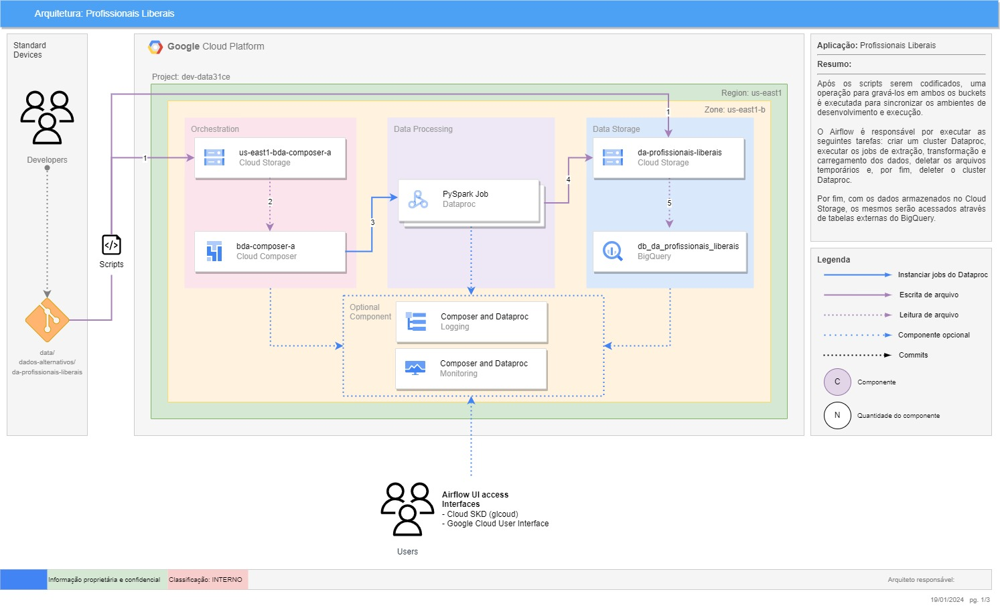
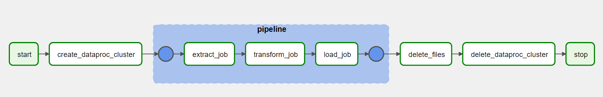

# PROFISSIONAIS LIBERAIS

## 1. Objetivo

O objetivo é disponibilizar os dados coletados para as áreas de negócios.

## 2. Solução Proposta

Realizar Web Scraping referente a consultas de conselhos de classe de forma automatizada para o processo de consulta de profissionais liberais.

## 3. Instalação

### Clone o repositório:

```bash
git clone git@gitlab.bvsnet.com.br:data/dados-alternativos/da-profissionais-liberais.git
cd da-profissionais-liberais
```

### Crie, ative e instale em um ambiente virtual:

Mac/Linux:

```bash
python -m venv <your-venv>
source <your-venv>/bin/activate
pip install -r requirements.txt
```

Windows:

```bash
python -m venv <your-venv>
<your-venv>\Scripts\activate
pip install -r requirements.txt
```

## 4. Implementação

Nesta seção constam os principais diagramas que mapeiam a infraestrutura da solução, bem como o fluxo dos dados.

### Diagrama de Arquitetura


### DAG



### Infraestrutura:

Todos os recursos em nuvem foram provisionados via Terraform. Para consultar a configuração de cada componente, acessar o diretório `data/dados-alternativos/profissionais-liberais`.

## 5. Descrição do Processo

O processo é orquestrado de ponta a ponta pelo Airflow. Em alto nível, o funcionamento da solução pode ser descrito a partir das seguintes etapas:
1. O cluster Dataproc é criado e são executados 3 PySpark Job sequencialmente.
2. PySpark Job (Extract): Os dados são raspados das URLs e armazenados em formato `csv` na camada `staging`.
3. PySpark Job (Transform): Em seguida, esses arquivos são lidos, processados e armazenados na camada `transient`.
4. PySpark Job (Load): Depois, os arquivos já devidamente tratados, são lidos e gravados no formato `parquet`na camada `trusted`.
5. Os arquivos parquet são acessados em tabelas externas via query em tempo de execução no BigQuery.
6. Os arquivos armazenados na camada temporária são deletados.
7. Por fim, o cluster Dataproc é deletado.

## 6. Estrutura do Projeto
Nesta seção é descrito o funcionamento de cada um dos módulos da aplicação.

------------
    ├── .config <- Scripts de configuração geral da aplicação.
    │    ├── .pylintrc <- Script de configuração usado para o Pylint.
    │    ├── docker.sh <- Script shell que instala o docker no cluster Dataproc.
    │    ├── pip_install.sh <- Script shell que instala as bibliotecas python no cluster Dataproc.
    │    ├── setup.cfg <- Script de configuração usado para bibliotecas de análise estática.
    ├── imgs <- Imagens de diagramas de arquitetura.
    ├── dags <- Scripts com das DAGS executadas. 
    ├── src <- Código fonte para uso neste projeto.
    │   ├── pipeline <- Scripts para execução das etapas de ETL.
    │   │   ├── extract <- Scripts para extração dos dados.
    │   │   ├── load <- Scripts para ingestão dos dados.
    │   │   ├── transform <- Scripts para processamento e transformação dos dados.
    │   ├──tests <- Scripts para executar testes automatizados.
    │   ├── utils <- Scripts para dar suporte aos demais módulos do projeto.
    │   │   ├── ci <- Script para gravar arquivos no bucket para criação de tabelas externas do BigQuery.
    │   │   ├── dataframe <- Scripts para interagir com DataFrames.
    │   │   ├── gcp <- Scripts para interagir com recursos do GCP.
    │   │   ├── helpers <- Scripts com módulos de suporte.
    │   │   ├── spark <- Scripts para interagir com a API PySpark.
    │   │   ├── time <- Scripts com módulos para lidar com variáveis temporais. 
    │   │   ├── web_tools <- Scripts utéis para interar com páginas da web.
    ├── .dockerignore <- Script que lista padrões de arquivos e diretórios a serem ignorados pelo Docker.
    ├── .gitignore <- Script que lista padrões de arquivos e diretórios a serem ignorados pelo Git durante o controle de versão.
    ├── .gitlab-ci.yml <- Script YAML que especifica as instruções para GitLab CI/CD.
    ├── .pre-commit-config.yml <- Script YAML usado para configurar os hooks de pre-commit.
    ├── Dockerfile <- Script Docker para construir o contêiner da aplicação.
    ├── README.md <- O README de nível superior para desenvolvedores que usam este projeto.
    ├── requirements.txt <- O arquivo de requisitos para reproduzir o ambiente de análise, e.g. gerado com o pip freeze > requirements.txt
    ├── setup.py <- Script de configuração usado para instalar, empacotar e distribuir o projeto Python.
--------


## 7. Utilização

Os scripts para serem executados precisam estar armazenados em buckets. \
No caso da execução das DAGS, é necessário que os arquivos estejam no diretório `dags` do ambiente Composer. \
No caso do jobs executados no Dataproc, é necessário porque o Dataproc executa os jobs em um workspace próprio, dessa forma, copiam os arquivos de execução que estão em um bucket para o workspace. \
Por fim, basta executar as dags na interface de usuário do Airflow que os jobs serão iniciados no Dataproc. \
Vale destacar que, no `.gitlab-ci.yml`, essas tarefas são automaticamente realizadas para os respectivos buckets quando o pipeline é executado.


## 8. Fonte dos dados

| Conselho de Classe                   | URL                                                                      | Data Implantação  |
|--------------------------------------|--------------------------------------------------------------------------|-------------------|
| Conselho Federal de Contabilidade    | https://www3.cfc.org.br/SPW/ConsultaNacionalCFC/cfc/consultaprofissional |                   |
| Conselho Federal de Fonoaudiologia   | https://fonoaudiologia.org.br/fonoaudiologos/especialista-por-area/      |                   |
<!-- | Conselho Federal de Educação Física  | https://www.confef.org.br/confef/registrados/                            |                   | -->
<!-- | Superintendência de Seguros Privados | https://www2.susep.gov.br/safe/Corretores/pesquisa                       |                   | -->


## 9. Documentações úteis

Para mais detalhes sobre o projeto, consultar as documentações abaixo:


## 10. Suporte

Em caso de dúvidas, contate os membros da Squad de Dados Alternativos:

PM: Patricia Ubaldo Malaquias - patricia.malaquias@equifax.com.br \
EN: Fernando Theodoro Guimarães - fernando.guimaraes@equifax.com.br
