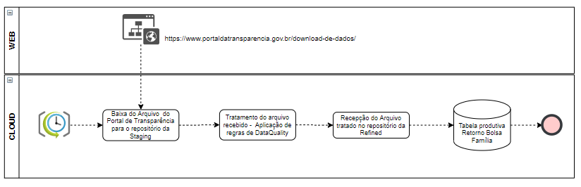
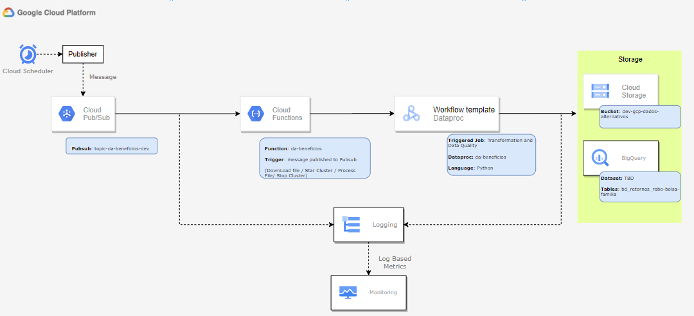

# BENEFICIOS BOT

## 1. Objetivo

Busca-se desenvolver uma aplicação capaz de capturar, armazenar e disponibilizar os dados públicos abertos de múltiplas fontes.

## 2. Solução Proposta

Esta aplicação consiste em rodar um cronjob programado pelo Cloud Scheduler que é executado via Dataproc Workflow para acessar a página do portal em questão, realizar o download dos arquivos, armazenar em um Bucket e realizar a ingestão no BigQuery. Os dados são obtidos através dos seguintes endereços:

### Benefícios Sociais

* Auxílio Brasil: https://portaldatransparencia.gov.br/download-de-dados/auxilio-brasil
* Auxílio Emergencial: https://portaldatransparencia.gov.br/download-de-dados/auxilio-emergencial
* Bolsa Família Pagamentos: https://portaldatransparencia.gov.br/download-de-dados/bolsa-familia-pagamentos
* Bolsa Família Saques: https://portaldatransparencia.gov.br/download-de-dados/bolsa-familia-saques 
* Garantia Safra: https://portaldatransparencia.gov.br/download-de-dados/garantia-safra 
* Seguro Defeso (Pescador Artesanal): https://portaldatransparencia.gov.br/download-de-dados/seguro-defeso 
* Erradicação do Trabalho Infantil (PETI): https://portaldatransparencia.gov.br/download-de-dados/peti 
* Benefício de Prestação Continuada (BPC): https://portaldatransparencia.gov.br/download-de-dados/bpc
* Seguro Desemprego: https://transparencia.sd.mte.gov.br/bgsdtransparencia/pages/downloadArquivos.xhtml

### Servidores Públicos

* Servidores Públicos Federais: https://portaldatransparencia.gov.br/download-de-dados/servidores
* Servidores Públicos Estaduais (SP): https://www.transparencia.sp.gov.br/PortalTransparencia-Report/Remuneracao.aspx
* Servidores Públicos Estaduais (MG): https://www.transparencia.mg.gov.br/estado-pessoal/remuneracao-dos-servidores
* Servidores Públicos Estaduais (ES): https://dados.es.gov.br/dataset/portal-da-transparencia-pessoal
* Servidores Públicos Estaduais (SC): https://dados.sc.gov.br/dataset/remuneracaoservidores
* Servidores Públicos Estaduais (DF): https://www.transparencia.df.gov.br/#/downloads#downloadServidores

### Sanções

* Empresas Inidôneas e Suspensas: https://portaldatransparencia.gov.br/download-de-dados/ceis
* Entidades sem Fins Lucrativos Impedidas: https://portaldatransparencia.gov.br/download-de-dados/cepim
* Empresas Punidas: https://portaldatransparencia.gov.br/download-de-dados/cnep
* Acordos de Leniência: https://portaldatransparencia.gov.br/download-de-dados/acordos-leniencia

### IBAMA - Autos de Infração

* Autos de Infração: https://dadosabertos.ibama.gov.br/dataset/fiscalizacao-auto-de-infracao/resource/b2aba344-95df-43c0-b2ba-f4353cfd9a00

### Fornecedores - Governo Federal

* Contratações: https://portaldatransparencia.gov.br/download-de-dados/compras

### Cadastro Nacional da Pessoa Jurídica - CNPJ

* CNPJs: https://dados.gov.br/dados/conjuntos-dados/cadastro-nacional-da-pessoa-juridica---cnpj


### Débitos Trabalhistas

* Dívida Ativa da União: https://www.gov.br/pgfn/pt-br/assuntos/divida-ativa-da-uniao/transparencia-fiscal-1/copy_of_dados-abertos


## 3. Instalação

### Clone o repositório:

```bash
git clone git@gitlab.bvsnet.com.br:data/dados-alternativos/beneficios-bot-function.git
cd beneficios-bot-function
```

### Crie, ative e instale em um ambiente virtual:

Mac/Linux:

```bash
python -m venv <your-venv>
source <your-venv>/bin/activate
pip install -r requirements.txt
```

Windows:

```bash
python -m venv <your-venv>
<your-venv>\Scripts\activate
pip install -r requirements.txt
```

## 4. Implementação

Conforme a arquitetura implantada, abaixo são ilustrados e descritos os principais componentes desse processo:

### Fluxo do Processo



### Desenho da Arquitetura



### Componentes

#### Infraestrutura:

Todos os recursos acima foram provisionados via Terraform. Para consultar a configuração de cada componente, acessar o diretório `data/dados-alternativos/beneficios`.

#### Cloud Scheduler:

Está agendado para a executar o cron job a cada 10 dias às 6h da manhã para invocar o acionador do Pub/Sub.

  1º: publica uma mensagem no tópico para iniciar a execução da Cloud Function.

#### Pub/Sub:

O tópico Pub/Sub é o trigger da Cloud Function. Dessa forma, ao ser invocado pelo Scheduler, inicia-se a execução da Cloud Function.

#### Cloud Function:

É responsável por executar três tarefas: ligar e desligar o Dataproc Cluster e instanciar o Dataproc Workflow.

#### Dataproc:

Nesta etapa vários jobs são iniciados, no qual são realizados os downloads dos arquivos compactados dos portais e o seu upload no bucket.

##### Cloud Storage:

Existem 2 buckets utilizados na aplicação.

  1º: estão armazenados o arquivo (**.csv**) que foi baixado dos portais públicos.
  2º: estão armazenados os arquivos (**.py**) responsáveis por executar os jobs para captura e ingestão.

#### Big Query:

Por fim, os dados tranformados são disponibilizados em tabelas externas no BigQuery.

#### Observações:

1. Na captura da base de Servidores Públicos Estaduais (SP), é necessário descompactar um arquivo **.rar** com a utilização da biblioteca **rarfile**. Apenas instalar o pacote python não é suficiente. Portanto, foi necessário instalar o pacote **unrar-free** no Dataproc Cluster através do arquivo **pip-install.sh** localizado no bucket:

* `gs://da-dataproc-inicialization-actions-dev/goog-dataproc-initialization-actions-us-east1/python/`

2. Para consultar no arquivo **pip-install.sh**, verificar o bloco com a function **install_packages()** em que consta a instalação do pacote ou para adicionar novos pacotes. Para acompanhar os logs gerados pelo cluster, acessar o arquivo **dataproc-initialization-script-0_output** localizado no bucket conforme exemplo abaixo.

* `gs://da-beneficios-prod-dataproc/google-cloud-dataproc-metainfo/00b40e21-c4eb-4f64-8d2d-74b969947ca8/da-beneficios-prod-m/dataproc-initialization-script-0_output`

## 5. Descrição do Processo


### Captura e Ingestão: Processos Diários

#### Execução:

O fluxo é iniciado diariamente nos períodos configurados no Cloud Scheduler, pois este irá publicar uma mensagem no tópico Pub/Sub.
A expressão cron configurada é `30 18 * * *` \
O arquivo executado para a ingestão dos dados é `ingestion.py`.

### Captura e Ingestão: Processos Mensais

#### Execução:

O fluxo é iniciado diariamente nos períodos configurados no Cloud Scheduler, pois este irá publicar uma mensagem no tópico Pub/Sub.
A expressão cron configurada é `30 6 */10 * *` \
O arquivo executado para a ingestão dos dados é `ingestion.py`.

## 6. Estrutura do Projeto

Nesta seção é descrito o funcionamento de cada um dos módulos da aplicação.

------------
    ├── src <- Código fonte para uso neste projeto.
    │   ├── data <- Scripts para aquisição e ingestão dos dados.
    │   │   ├── acquisition <- Scripts para aquisição dos dados.
    │   │   │   ├── tasks
    │   │   │   │    └── main_cronjob_*.py
    │   │   │   ├── scraping <- Scripts que dão suporte para a captura dos dados. 
    │   │   │   │    ├── file_downloader.py
    │   │   │   │    ├── file_processing.py
    │   │   │   │    ├── file_unpacking.py
    │   │   │   │    └── file_validation.py
    │   │   ├── ingestion <- Scripts para ingestão dos dados.
    │   │   │   ├── ingestion.py
    │   │   │   └── tasks
    │   │   │       └── task.py
    │   │   ├── processing <- Scripts para processamento dos dados.
    │   │   │    └── dataframe
    │   │   │       ├── columns.py
    │   │   │       ├── functions.py
    │   │   │       ├── processing.py
    │   │   │       └── schemas.py
    │   ├── utils <- Scripts para dar suporte aos demais módulos do projeto.
    │   │   ├── config <- Scripts para configurações gerais.
    │   │   │   ├── app_log.py  
    │   │   │   ├── spark.py
    │   │   │   ├── variables.py
    │   │   ├── gcp <- Scripts para interagir com recursos do GCP. 
    │   │   │   ├── bigquery
    │   │   │   │     └──
    │   │   │   ├── dataproc
    │   │   │   │     └──
    │   │   │   └── storage
    │   │   │        └──
    │   │   ├── date_utils.py
    │   │   └── utils.py 
    │   │
    │   ├──tests <- Scripts para executar testes automatizados.
    │   │   ├── integration
    │   │   │    └── test_*.py
    │   │   ├── unit
    │   │   │    └── test_*.py
    ├── .gitignore <- Script que lista padrões de arquivos e diretórios a serem ignorados pelo Git durante o controle de versão.
    ├── .gitlab-ci.yml <- Script YAML que especifica as instruções para GitLab CI/CD.    
    ├── Dockerfile <- Script Docker para construir o contêiner da aplicação.
    ├── main.py <- Script principal a ser executado pelo Cloud Function.
    ├── README.md <- O README de nível superior para desenvolvedores que usam este projeto.
    ├── requirements.txt <- O arquivo de requisitos para reproduzir o ambiente de análise, e.g. gerado com o pip freeze > requirements.txt
    ├── setup.py <- Script de configuração usado para instalar, empacotar e distribuir o projeto Python.
--------

## 7. Utilização

## 8. Roadmap

Nesta seção são apresentados os principais focos de evolução da aplicação:

1. Migrar processos de ingestão para Tabelas Externas do BigQuery.
2. Aumentar a taxa de cobertura de testes automatizados.
3. Refatorar os processos de captura mais antigos.
4. Orquestrar jobs via Airflow ao invés do Cloud Scheduler.

## 9. Documentações úteis

Seguem abaixo os links complementares para auxiliar no entendimento projeto.

[Análise de complexidade (Radon)](https://radon.readthedocs.io/en/latest/) \
[Vulnerabilidades de segurança (Bandit)](https://github.com/PyCQA/bandit) \
[Qualidade de código (Pylint)](https://pylint.readthedocs.io/en/latest/index.html) \
[Cobertura de código (Coverage)](https://coverage.readthedocs.io/en/7.2.7/) \
[Testes automatizados (Unittest)](https://docs.python.org/2/library/unittest.html)

## 10. Suporte

Em caso de dúvidas, por favor, contate os membros da Squad de Dados Alternativos:

PM: Patricia Ubaldo Malaquias - patricia.malaquias@boavistascpc.com.br \
<!-- TL: Vinicius Benites - vinicius.benites@boavistascpc.com.br \ -->
EN: Fernando Theodoro Guimarães - fernando.guimaraes@boavistascpc.com.br